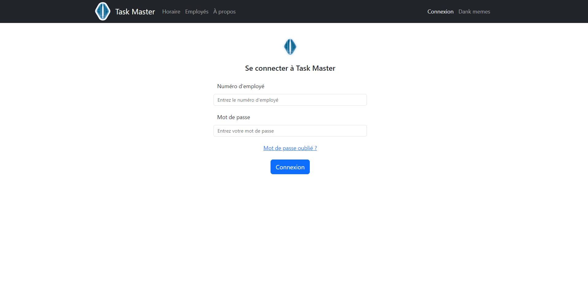

# TaskMaster Client

TaskMaster est un gestionnaire d'horaire pour entreprise. En tant qu'application web, TaskMaster est accessible partout et permet à une entreprise de mieux gérer ses effectifs.

[//]: # (TODO : Remplacez cette image par une capture d'écran de votre application.)

## Installation

Téléchargez la dernière version [stable de l'application][Releases]. Décompressez l'archive dans un dossier 
et mettez le en ligne sur un serveur web.

## Démarrage rapide

Ces instructions vous permettront d'obtenir une copie opérationnelle du projet sur votre machine à des fins de 
développement.

### Prérequis

* [Git] - Système de contrôle de version. Utilisez la dernière version.
* [NodeJs] - Environnement JavaScript.
* [IntelliJ Idea] - IDE. Vous pouvez utiliser également n'importe quel autre IDE.

### Compiler une version de développement

Clonez le dépôt. Téléchargez les dépendances *NodeJs* via la commande `npm i`. Ensuite, démarrez le programme
en mode débogage via la commande `npm run dev`.

### Compiler une version stable

Suivez les instructions pour compiler une version de développement. Ensuite, utilisez la commande `npm run build` pour créer une version prête à deployer dans le dossier `/build/`.

## Tester le projet

Vous êtes fortement encouragés à tester [la dernière version][Releases] de l'application. Si vous 
rencontrez un bogue, vous êtes priés de le [signaler][Submit Bug] et de fournir une explication détaillée du problème 
avec les étapes pour le reproduire. Les captures d'écran et les vidéos sont les bienvenues.

## Auteurs

* **David Lawton** - *Programmeur(Front-End)*
* **Romin Martignat** - *Programmeur(Front-End)*
* **Félix-Antoine Belleau** - *Programmeur(Back-End)*
* **William Blanchet Lafernière** - *Programmeur(Back-End)*
* **Benjamin Lemelin** - *Professeur en informatique*

## Changelog

Consultez la description de [la dernière version][Releases] de l'application.

## License

X

## Remerciements

X

[//]: # (Hyperliens)
[Git]: https://git-scm.com/downloads
[NodeJs]: https://nodejs.org/en/
[IntelliJ Idea]: https://www.jetbrains.com/idea/

[Submit Bug]: https://github.com/BlobMaster41/DRFWClient/issues/new
[Releases]: https://github.com/BlobMaster41/DRFWClient/releases